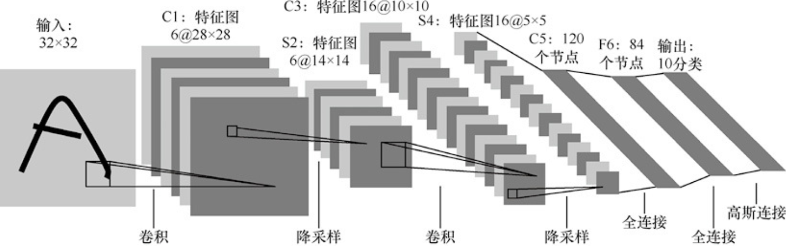

# LetNet-5和AlexNet

使用CNN解决图像分类问题可以往前追溯到1998年LeCun发表的论文，其中提出了用于解决手写数字识别问题的LeNet。LeNet又名LeNet-5，是因为在LeNet中使用的均是5×5的卷积核。LeNet-5的网络结构如下图所示。



LetNet-5的网络结构

LeNet-5中使用的结构直接影响了其后的几乎所有CNN，卷积层 + 降采样层 + 全连接层至今仍然是最主流的结构。卷积操作使网络可以响应和卷积核形状类似的特征，而降采样操作则使网络拥有了一定程度的不变性。

* **第一层：卷积层（C1）：** 这一层的输入就是原始的图像像素：若图像是灰度图(单通道)，LeNet接受的输入层大小为1x32x32，若图像是彩色RGB图(三通道)，LeNet接受的输入层大小为3x32x32；卷积核的尺寸为5x5，个数为6，不使用padding，步长为1；因为没有使用padding，所以这一层的特征图输出尺寸为32-5+1=28，通道数为6，即输出 feature map为 6x28x28；
* **第二层：池化层（S2） ：**输入为一个6x28x28；本层采用的池化窗口大小为2x2，步长为2，所以本层的输出矩阵大小为6x14x14；
* **第三层：卷积层（C3）：** 输入为6x14x14；本层卷积核的尺寸为5x5，个数为16，本层不使用padding，步长为1，所以本层的输出矩阵大小为 16x10x10；
* **第四层：池化层（S4）：** 输入为16x10x10；本层采用的池化窗口大小为2×2，步长为2，所以本层的输出矩阵大小为16x5x5；
* **第五层：全连接的卷积层（C5）：** 输入为16x5x5；本层卷积核的尺寸为5×5，个数为120；输出矩阵大小为120x1x1；通过 reshape，转化为120维的向量。
* **第六层：全连接层（F6）：** 输入节点个数为120个，输出节点个数为84个；
* **第七层：输出层（Output）：** 本层的输入节点个数为84个，输出节点个数为10个，分别代表数字0到9。&#x20;

代码如下：

```python
# 定义网络
class LeNet(nn.Module):                    # 继承父类nn.Module
    # 初始化网络
    def __init__(self):                    
        super(LeNet, self).__init__() 
        self.conv1 = nn.Conv2d(3, 16, 5)
        self.pool1 = nn.MaxPool2d(2, 2)
        self.conv2 = nn.Conv2d(16, 32, 5)
        self.pool2 = nn.MaxPool2d(2, 2)
        self.fc1 = nn.Linear(32*5*5, 120)
        self.fc2 = nn.Linear(120, 84)
        self.fc3 = nn.Linear(84, 10)
     
    # 正向传播                        # 图像尺寸参数变化
    def forward(self, x):            # input(3, 32, 32)        
        x = F.relu(self.conv1(x))    # output(16, 28, 28)
        x = self.pool1(x)            # output(16, 14, 14)
        x = F.relu(self.conv2(x))    # output(32, 10, 10)
        x = self.pool2(x)            # output(32, 5, 5)
        # x.view()：对tensor进行reshape，即重构张量的维度
        # x = x.view(x.shape[0], -1) 展平为[1个批量大小的行,32*5*5=800列]的矩阵，矩阵的每一行就是这个批量中每张图片的各个参数（即32*5*5），即矩阵中一行对应一张图片
        x = x.view(-1, 32*5*5)       # output(32*5*5) 1个批量大小的行 32*5*5=800列
        x = F.relu(self.fc1(x))      # output(120)
        x = F.relu(self.fc2(x))      # output(84)
        x = self.fc3(x)              # output(10)
        
        return x
    
# 测试验证【可选】  
# import torch
# input = torch.rand([50,3,32,32])
# model = LeNet()
# print(model)
# output = model(input)
```


