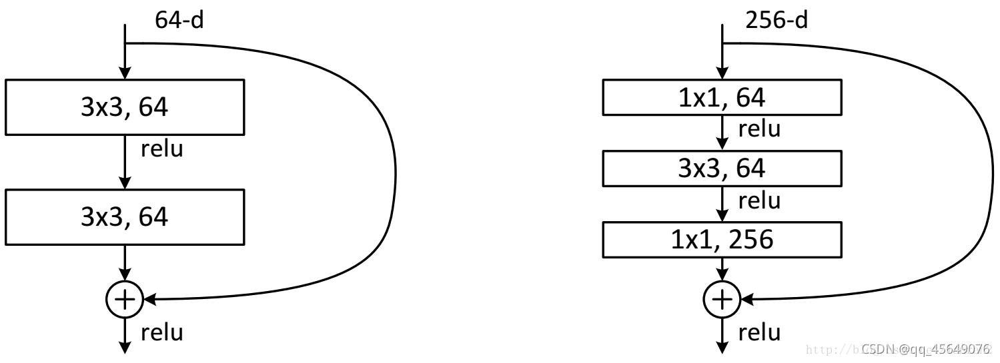

# ResNet

在VGG中，网络深度达到了19层。在GoogLeNet中，网络史无前例地达到了22层。网络深度能不能进一步加深呢？网络层数增多一般会产生**梯度消失或梯度爆炸问题**。 ResNet 是2015年由当时微软研究院的Kaiming He等提出，通过使用残差学习成功训练出了152层的神经网络，并在**ILSVRC2015比赛中取得冠军**，在top5上的错误率为3.57%，同时参数量大大降低，性能突出。

## 1、Bottleneck结构

ResNet提出使用 residual learning 解决网络退化问题。下图是两种不同的残差结构，左边的结构称为 BasicBlock，右侧的称为 Bottleneck （叫做Bottleneck是因为两边是256个通道，中间是64个通道，像一个bottleneck）。网络中使用的主要是右侧的 Bottleneck，第一层的1× 1的卷积核的作用是对特征矩阵进行降维操作，将特征矩阵的深度由256降为64; 第三层的1× 1的卷积核是对特征矩阵进行升维操作，将特征矩阵的深度由64升成256。 降低特征矩阵的深度主要是为了减少参数的个数。先降维后升维是为了主分支上输出的特征矩阵和 shortcut 分支上输出的特征矩阵形状相同，以便进行加法操作。

<figure><figcaption></figcaption></figure>

之所以叫 ResNet，因为正常的网络可以表示为y=H(x)，而残差网络一个残差块可以表示为 H(x)=F(x)+x，也就是 F(x)=H(x)-x，网络模块 F(x) 可以看成是在学习实际输出和输入x之间的残差，所以命名为残差模块。

有了这个结构，我们就可以搭建非常深的网络。下图是 ResNet18 网络的基本结构，

## 2、
