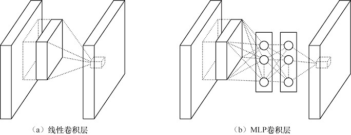
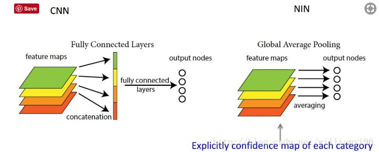
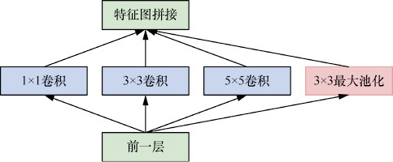
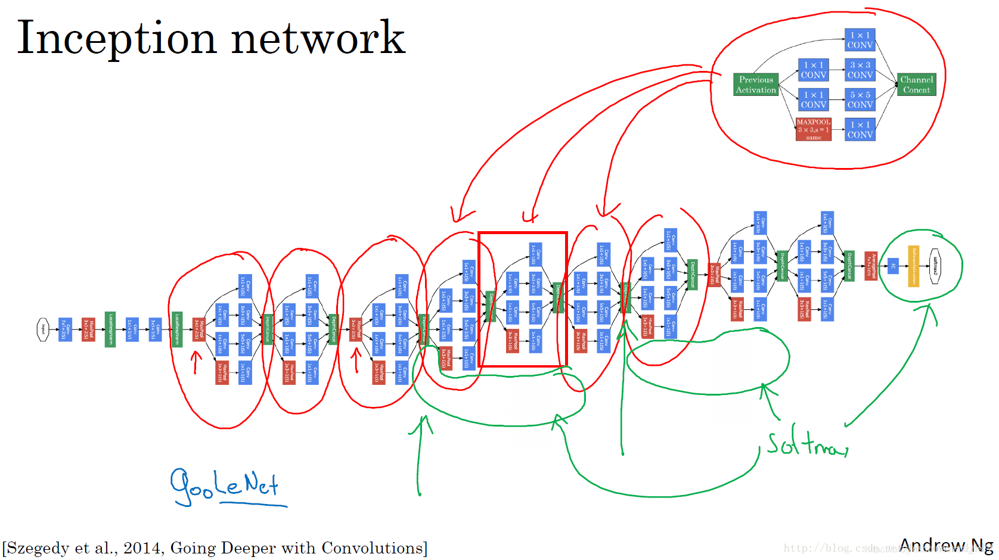
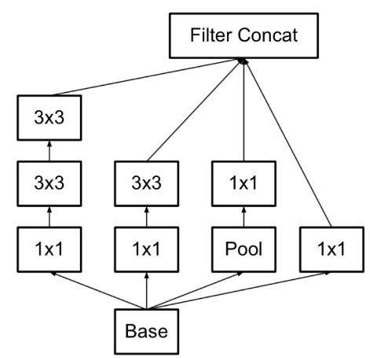
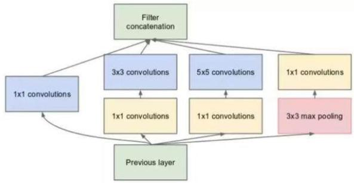

# GoogLeNet网络：更宽

2012年之后，CNN的研究分成了两大流派，并且两大流派都在2014年有重要的研究成果发表。一个流派的研究方向是增加CNN的深度和宽度，经典的网络就是VGG。另外一个流派的研究方向是增加卷积核的拟合能力，或者说是增加网络的多样性，典型的网络是可以拟合任意函数的NIN，以及本节要解析的基于Inception的GoogLeNet。

## 1、Network In Network（NIN）

> 【ICLR2014】Network In Network
>
> 作者：Min Lin, Qiang Chen, Shuicheng Yan

NIN的节点理论上可以逼近任何函数。在NIN中，作者也采用整图滑窗的形式，只是将CNN的卷积核替换成了一个小型MLP网络，如下图所示。

<figure><figcaption><p>NIN中的 MLP卷积层</p></figcaption></figure>

在卷积操作中，一次卷积操作仅相当于卷积核和滑窗的一次矩阵乘法，其拟合能力有限。而MLP替代卷积操作增加了每次滑窗的拟合能力。通过实验可以发现：

* NIN的参数数量远大于同类型的CNN；
* NIN的收敛速度快于经典网络；
* NIN的训练速度慢于经典网络。

```python
def nin_block(in_channels,out_channels,kernel_size,strides,padding):
    blk = nn.Sequential(
        nn.Conv2d(in_channels,out_channels,kernel_size,strides,padding)
        nn.ReLU()
        nn.Conv2d(out_channels,out_channels,kernel_size=1)
        nn.ReLU()
        nn.Conv2d(out_channels,out_channels,kernel_size=1)
        nn.ReLU())
    return blk    
```

对比全连接，NIN中的1×1卷积操作保存了网络隐层节点和输入图像的位置关系，1×1卷积的这个特点使其在物体检测和分割任务上得到了更广泛的应用。除了保存特征图的位置关系，**1×1卷积还有两个用途：实现feature map 的升维和降维； 实现 feature map 中跨 channel 特征的交互。**

此外，NIN提出了使用\*\*全局平均池化（global average pooling，GAP）\*\*来减轻全连接层的过拟合问题。之前用于分类的网络最后都有几个全连接层。全连接层有一个致命的缺点是：参数量过大。GAP直接剔除了全连接层中黑箱的特征，直接赋予了每个channel实际的类别意义。做法是需要分多少个类别，卷积层就输出多少 feature map；然后直接分别对 feature map 进行平均值计算得到结果，最后用softmax进行分类。

<figure><figcaption></figcaption></figure>

## 2、Inception V1 和 GoogLeNet

GoogLeNet的核心部件叫作Inception （来自于电影《盗梦空间》）。在每个Inception模块中，作者并行使用了1×1、3×3和5×5这三个不同大小的卷积核。同时，考虑到池化一直在CNN中扮演着积极的作用，作者在 Inception 中加入一个并行的步长为1的最大池化。至此，InceptionV1诞生了，如图下图所示。

<figure><figcaption><p>InceptionV1模块</p></figcaption></figure>

GoogLeNet的命名方式是为了致敬第一代深度卷积网络LeNet-5，作者通过堆叠Inception的方法构造了一个包含9个Inception模块、共22层的网络，并一举拿下了2014年ILSVRC的物体分类任务的冠军。GoogLeNet的网络结构如下图所示。

<figure><figcaption></figcaption></figure>

对比其他网络，GoogLeNet的一个最大的不同是在中间多了两个softmax分支作为辅助损失（auxiliary loss）函数。在训练时，这两个softmax分支的损失会以0.3的比例添加到损失函数上。根据论文的解释，该分支有如下两个作用： 1）保证较低层提取的特征也有分类的能力； 2）具有提供正则化并解决梯度消失问题的能力。 需要注意的是，在测试的时候，这两个softmax分支会被移除。

## 3、Inception V2 和 V3

一个5×5的卷积核与两个3×3的卷积核拥有相同大小的感受野，但是两个3×3的卷积核拥有更强的拟合能力，所以在Inception v2的版本中，作者将5×5的卷积核替换为两个3×3的卷积核，也非常简单，这里不再多说。

<figure><figcaption></figcaption></figure>

Inception v3将Inception v1和Inception v2中的n×n 卷积换成一个n ×1 和一个1×n 的卷积，这样做带来的好处有如下几点： （1）节约了大量参数，提升了训练速度，减轻了过拟合的问题； （2）多层卷积增加了模型的拟合能力； （3）非对称卷积核的使用增加了特征的多样性。

之前我写过一个Inception代码的实现，详细可以参考这个：

[https://github.com/OUCTheoryGroup/colab\_demo/blob/master/05\_05\_GoogLeNet\_CIFAR10.ipynb](https://github.com/OUCTheoryGroup/colab\_demo/blob/master/05\_05\_GoogLeNet\_CIFAR10.ipynb)

值得注意的是，在 Inception A 模块中，使用了 1X1 的卷积对 feature map进行降维，大大降低了网络的参数量（如下图所示）。这个在《深度学习：算法到实战》视频课程中有详细的解释，这里不再多说。

<figure><figcaption></figcaption></figure>

后来出现 InceptionV4 是受了ResNet影响，引入了残差结构来提升性能。这里不再过多介绍。
