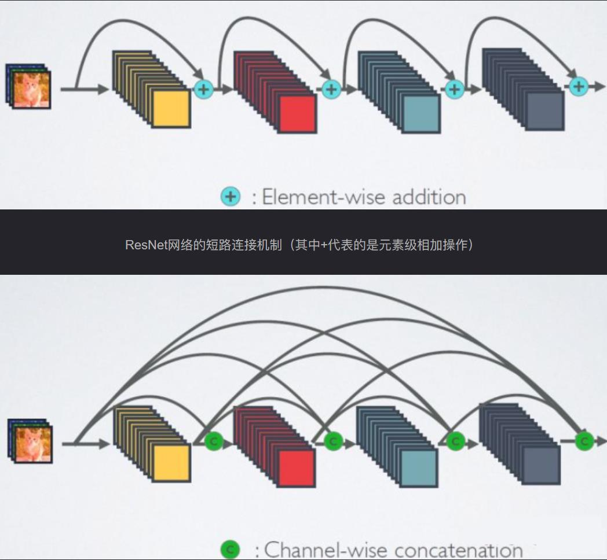
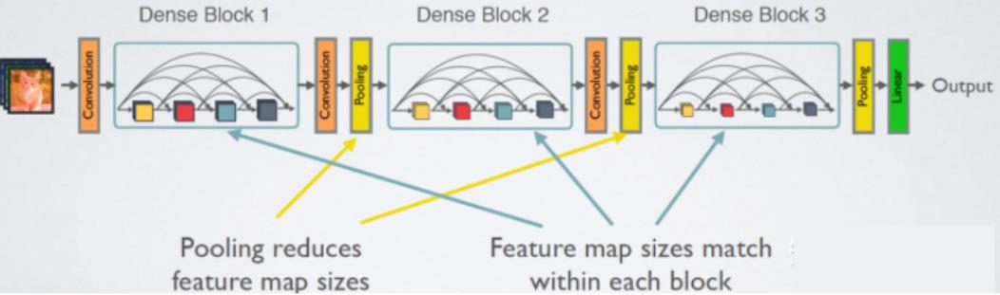

# DenseNet

> 【CVPR2017】Densely Connected Convolutional Networks
>
> 这是清华大学黄高老师的代表作

DenseNet 建立的是前面所有层与后面层的密集连接（dense connection），它的名称也是由此而来。其另一大特色是通过特征在channel上的连接来实现特征重用（feature reuse）。这些特点让DenseNet在参数和计算成本更少的情形下实现比ResNet更优的性能，DenseNet也因此斩获CVPR 2017的最佳论文奖。

DenseNet提出了一个更激进的密集连接机制：即互相连接所有的层，具体来说就是每个层都会接受其前面所有层作为其额外的输入。下图为ResNet和 DenseNet的对比。可以看到，ResNet连接方式是元素级相加。而在DenseNet中，每个层都会与前面所有层在channel维度上拼接（concat）在一起（这里各个层的特征图大小是相同的），并作为下一层的输入。DenseNet 更加密集，而且直接concat来自不同层的特征图，这可以实现特征重用，提升效率，这一特点是DenseNet与ResNet最主要的区别。&#x20;

<figure><figcaption></figcaption></figure>

因为特征在不断拼接，考虑到显存，显然无法应用到比较深的网络中。因此 DenseNet 采用了下图所示的结构。由于DenseNet需要在内存中保存密集块的每个节点的输出，此时需要极大的显存才能支持较大规模的DenseNet，这也导致了现在工业界主流的算法依旧是ResNet。

<figure><figcaption></figcaption></figure>
