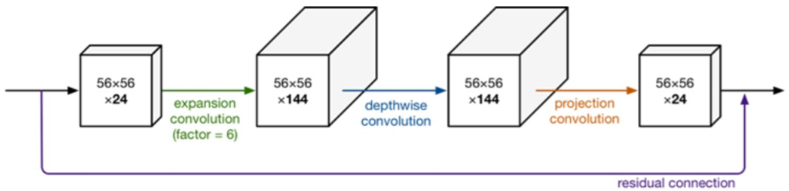

# MobileNetV2

> _**MobileNetV2: Inverted Residuals and Linear Bottlenecks, CVPR 2018.**_
>
> _**谷歌公司**_

MobileNet V1 结构非常简单， 发明了 Depthwise 和 Pointwise 卷积，但是没有使用RestNet里的residual learning；另一方面，Depthwise Conv确实是大大降低了计算量，但实际中，发现不少训练出来的kernel是空的。

ResNet 中的 bottleneck （两头粗，中间细，所以得名），先用1x1卷积把通道数由256降到64，然后进行3x3卷积，不然中间3x3卷积计算量太大。所以bottleneck是两边宽中间窄（也是名字的由来）。

但是在 MobilenetV2中，反了过来，输入是24维，输出也是24维，但中间我们扩展了6倍。网络是中间胖、两头窄，**所以叫做 Inverted residule block。**

**其中的原理是：**通道越少，卷积层的乘法计算量就越小。那么如果整个网络都是低维的通道，那么整体计算速度就会很快。然而，这样效果并不好，没有办法提取到整体的足够多的信息。所以，如果提取特征数据的话，我们可能更希望有高维的通道来做这个事情。V2就设计这样一个结构来达到平衡。

V2中首先扩展维度，然后用depthwise conv来提取特征，最后再压缩数据，让网络变小。

<figure><figcaption></figcaption></figure>

代码如下，也比较容易理解。B站上有网友对于 MobileNetV2 的详细视频解读《[MobileNet网络详解](https://www.bilibili.com/video/BV1yE411p7L7)》，可以结合视频学习。

```python
# 通过 expansion 增大 feature map 的数量
planes = expansion * in_planes
self.conv1 = nn.Conv2d(in_planes, planes, kernel_size=1, stride=1,   
    padding=0, bias=False)
self.bn1 = nn.BatchNorm2d(planes)
self.conv2 = nn.Conv2d(planes, planes, kernel_size=3, stride=stride,
    padding=1, groups=planes, bias=False)
self.bn2 = nn.BatchNorm2d(planes)
self.conv3 = nn.Conv2d(planes, out_planes, kernel_size=1, stride=1, 
    padding=0, bias=False)
self.bn3 = nn.BatchNorm2d(out_planes)
```

再后来，谷歌公司又提出了MobileNetV3，主要特点是结合了 SENet 中的注意力机制。不再过多介绍，感兴趣可以看 B站网友的教学视频《[MobileNetv3网络详解](https://www.bilibili.com/video/BV1GK4y1p7uE)》。
