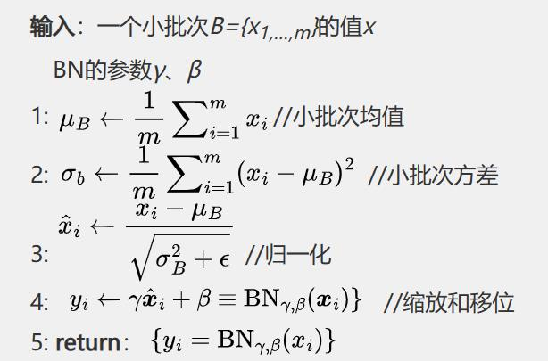
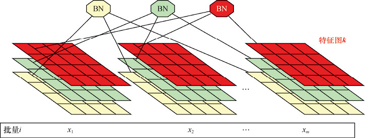

# BN

Batch Normalization (BN) 是在深度学习中缓解过拟合时选择的诸多技巧中使用频率非常高的一个经典算法，它不仅能够有效地解决梯度爆炸的问题，而且加入BN层的网络往往更加稳定且BN还起到了一定的正则化的作用。

在之前 ResNet 中我们介绍了 BN 的原理与好处，可以知道，BN的目的是使 feature map 满足均值为0，方差为1的分布规律。算法如下所示：

<figure><figcaption></figcaption></figure>

在CNN中，假设一个 batch 有 m 个样本，feature map 尺寸是 pxq，通道数是 d。在CNN中，BN的操作是以 feature map 为单位的，因此，一个 BN 要统计数据的个数是 mxpxq，每个特征图使用一组 $$\gamma$$ 和 $$\beta$$ 。统计方法如下图所示。

<figure><figcaption></figcaption></figure>

