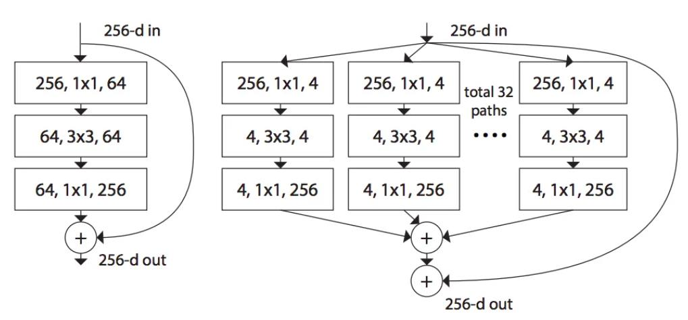

# ResNeXt

> 【CVPR2017】Aggregated Residual Transformations for Deep Neural Networks
>
> 作者：Saining Xie, Ross Girshick, Piotr Dollár, Zhuowen Tu, Kaiming He

ResNeXt本质是分组卷积（group convolution），可以看作是普通卷积和depth-wise conv的折中方案，即将特征图分为若干组，在每个组内部使用普通卷积进行计算。

<figure><figcaption></figcaption></figure>

如图所示，左边是普通的ResNe结构，右边是ResNeXt。相当于是有32个独立的卷积组。每个组里先用1x1卷积，将通道数由256变为4，然后再分别进行3x3卷积，再用1x1卷积将通道数变成256。最后将32组特征直接相加。这里32被称为cardinality。

代码如下：

```
class ResNeXt_Block(nn.Module):
    """
    ResNeXt block with group convolutions
    """
​
    def __init__(self, in_chnls, cardinality, group_depth, stride):
        super(ResNeXt_Block, self).__init__()
        self.group_chnls = cardinality * group_depth
        self.conv1 = BN_Conv2d(in_chnls, self.group_chnls, 1, stride=1, padding=0)
        self.conv2 = BN_Conv2d(self.group_chnls, self.group_chnls, 3, stride=stride, padding=1, groups=cardinality)
        self.conv3 = nn.Conv2d(self.group_chnls, self.group_chnls*2, 1, stride=1, padding=0)
        self.bn = nn.BatchNorm2d(self.group_chnls*2)
        self.short_cut = nn.Sequential(
            nn.Conv2d(in_chnls, self.group_chnls*2, 1, stride, 0, bias=False),
            nn.BatchNorm2d(self.group_chnls*2)
        )
​
    def forward(self, x):
        out = self.conv1(x)
        out = self.conv2(out)
        out = self.bn(self.conv3(out))
        out += self.short_cut(x)
        return F.relu(out)
```

需要强调的是，分组卷积是介于普通卷积和depth-wise conv 之间的一种折中方案。实践表示，特征分组可以有效的提升网络性能，有一种解释是 <mark style="color:blue;">**特征分组可以建立一系列的子空间，在子空间里可以学习更加丰富的特征（比如对于人脸，有些空间专注于学习眼睛，有些特征专注于学习鼻子等）**</mark> 。在 Transformer 里面是通过 multi-head 来进行特征分组，都是类似的思路。
